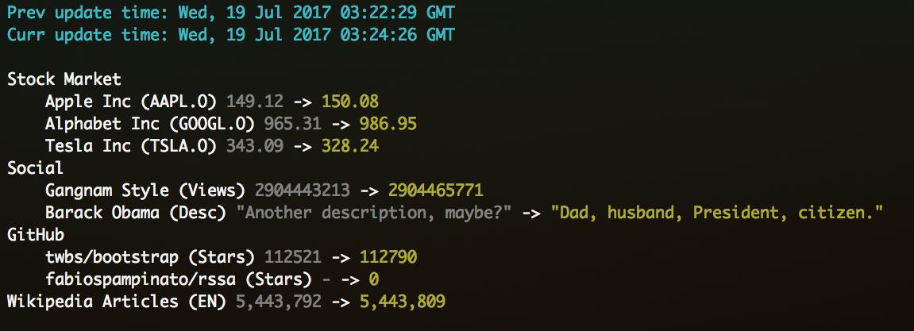

# RSSA

RSS-Anything, get updates about anything you can reach with an url. Like RSS, but for anything.

I built this because I was tired of refreshing pages just to check for updates. A classic RSS reader works fine if you are only looking for blog posts, but what if you want updates about the stock market, or the number of views of a youtube video, or about a person's twitter description, or maybe even the number of stars of a GitHub repo? RSSA to the rescue!

This is how it works:
1. You tell RSSA which urls you want to monitor
2. You tell it how to extract the information you want from those pages, via a regex, a DOM selector or some custom logic.
3. You tell it which reporter to use and how to display that information
4. You can compare the freshly extracted values with the ones from the previous run
5. You can choose to filter some rows out, for instance if the numbers you are monitoring didn't change from the previous run

## Install

```shell
$ npm install --global rssa
```

## Configuration

RSSA is configured via a JSON configuration file, you can supply your own via `rssa --config /path/to/config.json`.

This is what it looks like:

```js
{
  "cache": { // RSSA supports caching, probably only useful for not having to wait network delays while developing it
    "path": "/path/to/cache", // Where to store the cached pages
    "enabled": false // Is it enabled?
  },
  "feeds": { // "Feeds" are objects describing the resources to fetch, read more about them in the next section
    "path": "/path/to/feeds.js" // Where to find them
  },
  "fetch": { // How to fetch pages
    "headless": false, // Should we use Chrome's headless mode by default? It basically adds support for running javascript, useful for client-side rendered pages, but slow
    "chrome_path": "/path/to/Google\\ Chrome" // Where to find Chrome, you should probably update this field
  },
  "history": {
    "path": "/path/to/history.json" // Where to store the information fetched after each run
  },
  "report": { // RSSA will generate a report about the updates
    "active": "txt", // The reporter to use, possible values are `txt` and `html`
    "save": false, // Store the report in a file?
    "path": "/path/to/reports", // Where to store the reports. You can use some special date-related placeholders here.
    "name": "[year][month][day]-[hour][minute][second]" // Name of the report file, minus the extension. You can use some special date-related placeholders here.
  }
}
```

## Feeds

Feeds describe what will be shown in your reports, it's basically a node.js module that exports a `feeds` item describing which urls to fetch, how to extract the information from them and how to display that information.

Feeds can be deeply nested within groups, and their configuration inherits from their parent, so you if have 2 ore more urls sharing the same tokens, templates and filter function simply wrap them into a group and move those fields in there.

This is what it looks like:

```js
module.exports.feeds = { // Feeds object
  groups: [{ // Feeds can be nested into groups
    name: 'Foo', // Group name
    tokens: { // Tokens to extract, they will be substituted back into the template
      foo: '#foo', // DOM Selector
      bar: /bar/, // Regex
      baz: ( page, $ ) => {}, // Custom function, called with the string representation of the page and the result of cheerio.load ( page )
      qux: ['.my-class', val => `${val}!`], // Optional callback for transforming the token
    },
    filter: ( tokens, tokensOld ) => !tokensOld || tokens.value !== tokensOld.value, // If it returns false the current feed won't be displayed, it's called with the current tokens and those from the last run
    template: ( tokens, tokensOld ) => '[foo]/[bar] ([baz]) [old:value] -> [value]', // Function called with the current tokens and the previous ones that returns the string used for rendering the feed, [token] will be replaced with token's value, [old:token] references the old token.
    templates: { // If you use more than one reporter you may define a template for each of them
      txt: () => '', // Template used by the `txt` reporter
      html: () => '' // Template used by the `html` reporter
    }
    feed: 'http://www.example.com', // Single feed
    feeds: [ // Array of feeds
      'http://www.example.com', // Can be a plain url
      { // Or an object, its properties override those inherited from its parents
        headless: true, // Overrides the global `config.fetch.headless` setting for this feed
        filter: () => true, // Overrides its parent's filter function, if any
        url: 'http://www.example.com'
      }
    ]
  }, {
    // Another group...
  }]
};
```

## Usage

After having installed RSSA you will want to make a folder for it somewhere, in there you'll put your custom `config.json` and `feeds.js` files, then just call RSSA like this:

```bash
rssa --config /path/to/config
```

That's all! Check out what an actual report could look like, given the bundled [config.json](https://github.com/fabiospampinato/rssa/master/config.json) and [feeds.js](https://github.com/fabiospampinato/rssa/master/feeds.js]) files:



## Hints

- **Colors**: you may use [chalk](https://github.com/chalk/chalk) for styling your templates.
- **Alias**: if you use bash you can alias it for convenience, for instance you might want to add this to your `~/.bash_profile`: `alias updateme="rssa --config /path/to/config`. Then simply run `updateme` to get a report.
- **Multiple aliases**: you might want to create multiple feeds for RSS, then run each of them separately, so that you can have aliases like `up-stocks`, `up-social` or anything you can think of.
- **Cronjob**: set a cronjob to run RSSA every hour or so to always have fresh reports to read.
- **Cloud sync**: make it output the reports to your Dropbox folder, so that you can check them even without having access to your terminal.

## Future

- It stores the values it finds, so it could be pretty easy and quite interesting to have it plot charts about them for you. It basically could provide you with statistics about anything.
- It shouldn't be too difficult to make an RSS reporter, so that you can pipe it into your RSS client of choice.

## License

MIT © Fabio Spampinato
